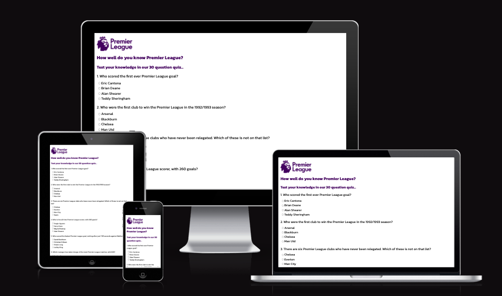
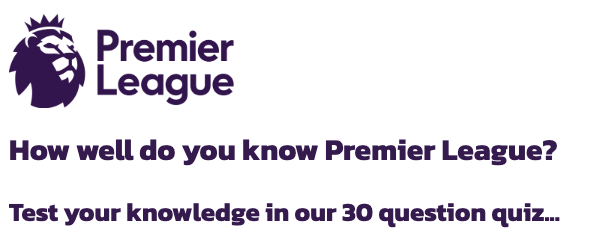
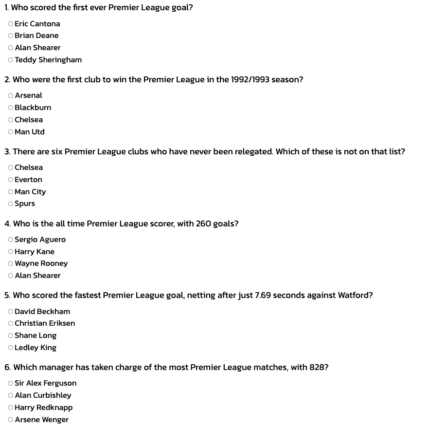
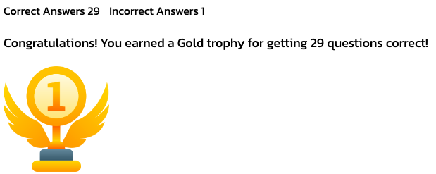
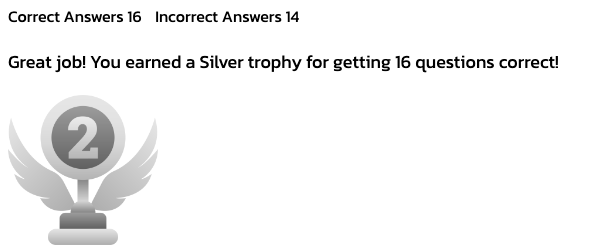
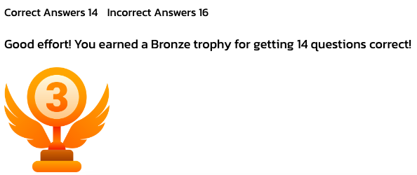
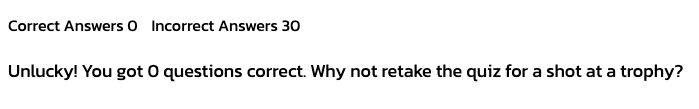

# Premier League Quiz

The website was created to test people's knowledge of the Premier League. It contains a mix of questions over the tournaments 30+ year history, making this a fantastic test for people of all ages!

A live version of the project can be found here - https://danfnkd.github.io/pl-quiz/.

# Table of Content

+ UX
    + Site Purpose
    + User Demographic
    + User Goals
    + Design
        + Colors
        + Typography
        + Images
+ Features
    + Existing Features
        + Header Section with Logo and Navigation Bar
        + Home Page Image
        + Home Page Section
        + Benefits Page Image
        + Benefits Page Section
        + Signup Page Image
        + Signup Page Section
        + Footer Section
+ Technologies Used
+ Testing
    + Validator Testing
    + Unfixed Bugs
+ Deployment
+ Content
+ Media
+ Credits

## UX

### Site Purpose

The quiz is designed to challenge users with 30 questions on the Premier League. For each question, the user is able to see if they have answered correctly. If not, they are presented with the correct answer to help improve their knowledge. They can see how many questions they answered correctly/incorrectly and a message/image is displayed when all questions are answered to reward performance.

### User Demographic

This website was created for:

- Premier League football fans
- Fans of other leagues looking to improve their knowledge
- Anybody interested in football

### User Goals

- Learn more about the Premier League - Current and historical
- See what they have scored

### Design

The project utilises very simple design as not to distract attention from the questions.

#### Colors

There are two colors used throughout the website, white (#ffffff) and dark purple (#3d195b). The purple was taken from the Premier League's new logo.

#### Typography

The Google Font [Kanit](https://fonts.google.com/specimen/Kanit?query=kanit) was chosen as the font for the text elements with a fallback of Sans-Serif.

#### Images

The Premier League logo was used on the page. Different trophies were selected to represent gold, silver and bronze.

## Features

The Premier League Quiz website is a single-page website consisting of the following sections:

- Premier League Logo and Heading
- Quiz Area
- Score Area
- Prize Area

### Existing Features

#### Premier League Logo and Heading

- The Premier League logo is featured to provide context to the quiz.
- The heading provides an overview of the quiz and aims to entice users to complete it.

#### Quiz Area

- The Quiz area is laid out simply to ensure nothing distracts the user from the quiz. Each question has four different options.

#### Score Area

- There is a score area at the bottom of the page that allows users to see their score once the quiz is submitted.

#### Prize Area

- Upon completion of the quiz, the user is presented with different text/imagery dependant on their score.

#### Features Left to Implement

- A video could have been added at the bottom of the quiz to highlight some of the best moments from the Premier League's history (i.e. best goals, best moments).

## Technologies Used

- HTML
- CSS
- Javascript

## Testing

Testing was conducted using Google Chrome and Safari (laptop and mobile). Testing different devices and screen resolutions was completed via Google DevTools.

Main issues discovered:

1. User was able to click submit without selecting an answer.
- Added an if statement to prevent this behaviour and display a message to the user.
2. User was able to select multiple radio boxes.
- Applied name attribute to questions in html.
3. A submit button was applied to each question but this didn't lead to a good user experience.
- The individual submit buttons were removed and a single one was added at the end of the quiz.
4. Favicon was stretched.
- Sourced new image to use.

### Validator Testing

- HTML
    - No errors were returned when the code was passed through the official .
- CSS
    - No errors were returned when the code passed through the official .
- Javascript
    - No errors were returned when the code passed through the official .
        -   The following metrics were returned:
        -   There are 10 functions in this file.
        -   Function with the largest signature take 3 arguments, while the median is 1.
        -   Largest function has 24 statements in it, while the median is 4.
        -   The most complex function has a cyclomatic complexity value of 6 while the median is 2.

### Unfixed Bugs

- All of the bugs were fixed and added to the Testing section.

## Deployment

CodeAnywhere and GitPod were used as the IDE's for this project. Regular commits and pushes to GitHub were made for version control and to track development.

The live version of the project was deployed to GitHub Pages.

Deployment process:

1. Log into GitHub
2. Find and load relevant GitHub repository
3. Select "Settings"
4. Click "Pages" in the Code and automation section
5. Select "Main" as the branch and "/root" as the folder
6. Click "Save"
7. The "github-pages" link is now visible in the "Deployments" section on the repository

A live version of the project can be found here - https://danfnkd.github.io/pl-quiz/.

## Content

- Questions for the quiz were taken from the Premier League website:
    - https://www.premierleague.com/news/2743086
- Instructions on how to implement forEach loops was taken from this ![YouTube] (https://www.youtube.com/watch?v=uOZWH0KEUs4).
- Assistance with implementing mapping was taken from this ![YouTube] (https://www.youtube.com/watch?v=hLgUTM3FOII).
- The icons in the footer section were taken from [Font Awesome](https://fontawesome.com/).

## Media

- The logo image used in the project were taken from the Premier League's [Wikipedia Page](https://en.wikipedia.org/wiki/Premier_League).
- The trophy icons were taken from [Flaticon](https://en.wikipedia.org/wiki/Premier_League). 

## Credits

Martina Terlevic
    - My Code Institute Mentor, thank you for your help with queries and time management!

